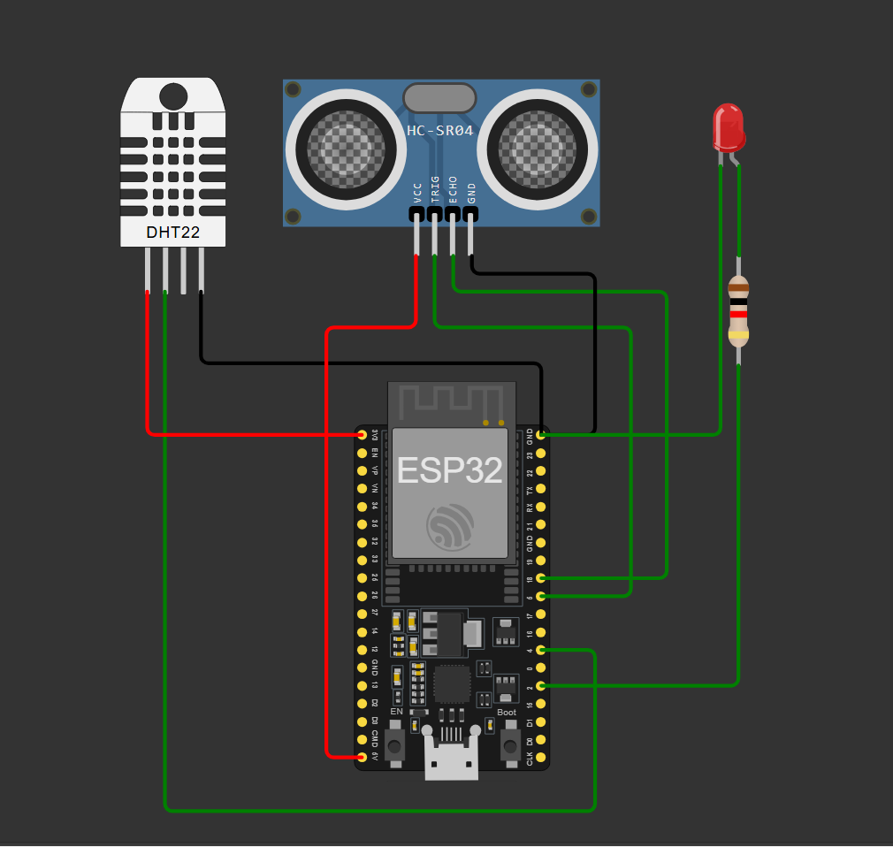
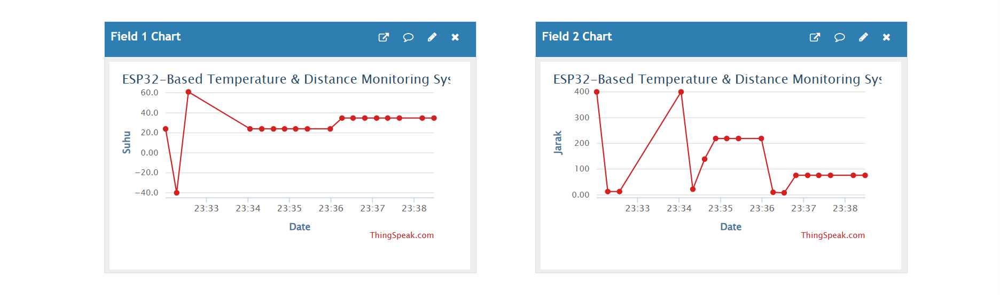

# 🌐 Smart Environment Monitoring System (ESP32)

## 📌 Deskripsi
Sistem IoT berbasis ESP32 untuk memonitor suhu dan jarak secara real-time, serta mengirim data ke ThingSpeak untuk visualisasi dashboard online.

---

## 🚀 Fitur
- 🌡️ Monitoring suhu (DHT22)
- 📏 Monitoring jarak (HC-SR04)
- 💡 LED indikator kondisi
- 🌐 Koneksi WiFi (ESP32)
- 📊 Dashboard ThingSpeak

---

## 🔌 Wiring
| Komponen | Pin ESP32 |
|--------|---------|
| DHT22 | GPIO 4 |
| TRIG | GPIO 5 |
| ECHO | GPIO 18 |
| LED | GPIO 2 |

---

## 🧠 Logika Sistem
LED akan menyala jika:
- Suhu > 28°C
- Jarak < 15 cm

---

## 📷 Preview

---

## 📊 Dashboard
Data dikirim ke ThingSpeak dan divisualisasikan dalam bentuk grafik real-time.

---

## 🖥️ Teknologi
- ESP32
- Arduino
- ThingSpeak API
- DHT22 & Ultrasonic Sensor

---

## 🚀 Cara Menjalankan
1. Buka di Wokwi
2. Jalankan simulasi
3. Lihat Serial Monitor
4. Cek dashboard ThingSpeak

---

## 👨‍💻 Author
Bran Simbolon
